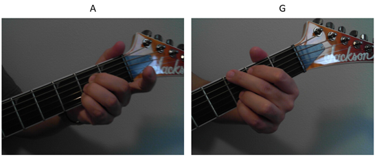
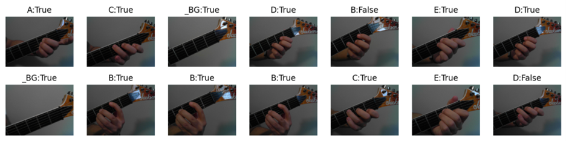
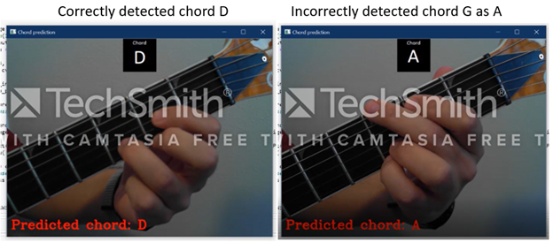
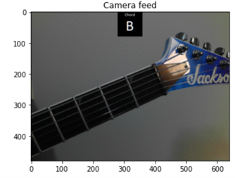
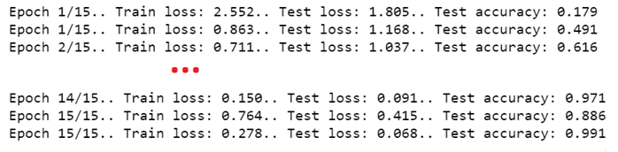
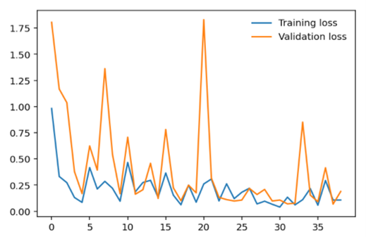

### CS 445 – Final Project: Report
# Guitar chord recognition

## Motivation: why build an application that recognizes guitar chords? 

The reason why I’ve chosen the Computational Photography class was to better understand how photos are processed, stored, how to manipulate images, and how I could extract information from a digital photography. On a personal note, I have an interest in music and have been playing and studying electric guitars for 25 years. 

One of the challenges for someone playing any instrument, is to reproduce a song they enjoy listening to. If the individual doesn’t have the sheet music for that song (a.k.a. the musical notation, or transcription), and if they can’t learn to play a song just by listening to it and reproducing the notes, one of the tools they have is to see how someone is playing that song to try and mimic the artist. Another scenario where computer-generated musical transcription would help occurs when a musician needs to transcribe a piece for a lesson, or for other professional reasons, such as to sell sheet music. My intent with this project is to build an application which will recognize guitar chords as someone plays a song, by pointing a camera at the hands of the artist and annotate those chords as someone plays them. 

This is a simple scenario in music notation but is potentially the first one to solve. Having resolved simple chords, by understanding the neck and finger positioning, and maybe even combined with the actual audio frequencies emitted by the song, this project could evolve to transcribe more complex music, including scales and guitar solos. For the scope of this project, I will focus on identifying a specific combination of guitar chords using computer vision. I’m hoping to learn how to use the relevant areas of an image (e.g.: the left hand of a guitarist on a scene that includes a stage, other individuals, and instruments), to train a classifier which will help me recognize the shape of the chord that’s being used, and to perform the actual classification in real-time, as the individual is playing and switching chords.

## Approach: using machine learning to predict chords
For a standard-tune electric guitar, major chords can be recognized visually just by looking at the position of the player’s fingers. This means that for a given chord, the positions of each of the player’s fingers in the neck provide hints about the chord that’s being played. As an example, the way fingers are positioned in the neck for the A chord looks different than how the fingers are positioned for the G chord. If someone who understands these “shapes”, or finger positions, glances at someone playing that chord, this person will recognize this chord even without hearing it. Image 1 illustrates this.

<b>Image 1: difference in the shape of chords A and G</b>

In image 1, note how for the A chord, fingers 2, 3 and 4 are being used sequentially, while finger 1 is resting. For the G chord, all four fingers are used, with finger 2 being positioned higher than all others, while fingers 3 and 4 are placed in the bottom of the guitar’s neck. 

I should also make it clear that there are different ways to play each chord, which will all look different, but still sound the same. Also, there is a very large number of chord variations that could be used by a player, including minor chords, augmented chords, dominant seventh, and dozens of others. 

The scope of this program is to recognize the basic, popular shape of major chords in guitars to prove the concept. By training a classifier with hundreds of images of each chord, my intent is to recognize in real time the chord that an artist is playing. 

## Results: objective achieved, but with constraints
My original intent was to be able to recognize major chords on any picture of artists playing them. This result was successfully achieved after extensive training of a classifier and using the optimal choice of training epochs, source data, and the best performing optimizer. The implementation details section of this document describes those choices. 

As seen on Image 2, the classifier can predict with high accuracy which chord is being played by the artist. This image shows the output when testing the classifier with test data. 

<b>Image 2: high accuracy with test data</b>

My objective, however, was to predict chords in real time as an artist performs. [This video](https://www.youtube.com/watch?v=N0Txtw1Iq0A) shows a live demonstration of this notebook capturing a camera feed and running predictions on the chords. This proves that the objective was achieved, despite some failed chords detected in a one occurrence. 

<b>Image 3: examples of real time feedback for the user</b>

On Image 3, for the instance where the classifier incorrectly classifies a chord on second [0:21 of the video](https://youtu.be/N0Txtw1Iq0A?t=21), observe that by insisting on the chord and changing the neck’s position in front of the camera, the algorithm corrects the prediction back to chord G on [second 0:26](https://youtu.be/N0Txtw1Iq0A?t=26). This sort of challenge is explored in the next session of this report. 

### Challenges 
There are challenges, however, to allow this classifier to predict chords more accurately. Here are some of the challenges that I faced, and how I would approach these problems with more time and resources: 
- Surface area for training and recognition: in this version, the classifier uses the whole picture to train a model as well as to recognize the chords. This means that any background to the image, guitar colors, skin colors and other artifacts can change how a chord is classified and predicted. With more time and resources, I would work to recognize the guitar’s neck, align it to identify the area of the neck that is being used, transform the image if the neck is not facing the camera view and train a classifier only when these objects are achieved. Likewise, I would use the same mechanism to crop and transform the relevant areas of the neck and use that for prediction.
- Use a more diverse dataset for training: guitars may differ in color, appearance, and other visual features. Also, an artist’s hand can have different skin colors, or use accessories such as rings. Finally, some artists are left-handed. All these aspects are used when the classifier is trained today, so I would need a more diverse dataset for training.
- Another simpler approach would be to recognize the area of the image that has the artist’s hand. I attempted to do this by using [Haar cascade object detection](https://docs.opencv.org/3.4/db/d28/tutorial_cascade_classifier.html), but could not successfully train a classifier that recognized hands. 

Late in my project, I came across project [MediaPipe from Google](https://ai.googleblog.com/2019/08/on-device-real-time-hand-tracking-with.html), which offers real-time analysis of hand gestures. I obtained mixed results with this library, as it did not do a great job at identifying finger positions when the thumb is not at display, or the fingers are too close to each other. This technique, however, would be the ultimate approach to resolve this problem as it would not require the training of classifiers with different guitars, colors, light schemes, or other features that can change how a scene looks like. It would only detect the position of each finger, and we could compute each chord based on those positions combined with their location in the guitar’s neck. 

## Implementation details: capturing data, and training a classifier 
My solution uses Python and was implemented on a Jupyter Notebook. My original plan was to capture 100 pictures of each chord to train a classifier, but my testing proved that I needed more pictures than that, so I took 250 pictures of each chord, resulting in 2000 pictures in total (250 for each of the seven major chords, plus 250 for a background without any chords). 
To capture 2000 pictures with the same basic scene and lighting scheme, I simply iterated through a for-loop 250 times for a single chord, taking approximately 8 pictures per second. To control the frame rate, I just used time.sleep(0.12). While the program captures the frames, I move my hand gently to provide different angles and slightly different positions for resting fingers in each chord. Frames for each chord are stored in folder output/{chord} in the project structure. 
To monitor the data capture process, the user sees the last capture as an output in the notebook. I used the ipwidgets library to offer a combo box where the user can select the chord that they will train next, and a check box to indicate if they want to add images to that chord’s folder, or clean that folder and start from scratch. The output also includes a small image on the top of the frame to indicate which chord is being trained now, since this is a repetitive process and can cause confusion. This image is a black box that gets copied into the frame and displayed in real time.

<b>Image 4: user feedback as chords are being trained</b>

The source images for the chord legend (the black box on the top of the frames) are stored in folder output/chords in the project structure.  

Once data has been captured, the next step is to create the objects required by the classifier. For this project, I used PyTorch and a ResNet pre-trained model. Data was split to allow 20% of the images to be used for testing, and 80% for training. 

For the classifier, after testing more than 20 different combinations of optimizers and settings, the best results were obtained with the [Adam class optimizer](https://pytorch.org/cppdocs/api/classtorch_1_1optim_1_1_adam.html). This process took several hours to complete as I trained this model with many different settings and optimizers.

The process used 15 epochs to maximize the results in lowering the cost function. I also tested this approach in several different options from 5, to 30 epochs find the optimal number of iterations without overfitting the model. This resulted in lowering test loss from more than 1.8 to less than 0.07 in the first iterations, while increasing the test accuracy from 17% to 99%, as illustrated in images 5 and 6.  

<b>Image 5: evolution of the loss functions and test accuracies</b>

 

<b>Image 6: evolution of the loss functions and test accuracies</b>

## Summary
This project proves the concept suggested to identify guitar chords by using computer vision. It demonstrates how a classifier can be trained to make predictions in real time using a camera feed, providing real time feedback to the user. 

For this project, however, the scope is limited to the images captured by the author on ideal conditions. New techniques can be explored to better capture data to train a classifier, or to simply analyze a hand’s posture and determine the artist’s fingers positions in real time. 

On the long term, this technique can be combined with audio capture to identify different chords, or artists playing on different guitar tunning, or even to capture more complex guitar techniques. 

## Acknowledgements
- Some code used to train the classifier in PyTorch was inspired by [the tutorial “How to Train an Image Classifier in PyTorch and use it to Perform Basic Inference on Single Images”](https://towardsdatascience.com/how-to-train-an-image-classifier-in-pytorch-and-use-it-to-perform-basic-inference-on-single-images-99465a1e9bf5)
- Music on the demo video performed by Pericles Rocha
- All images, videos, and code (except where listed above) by Pericles Rocha